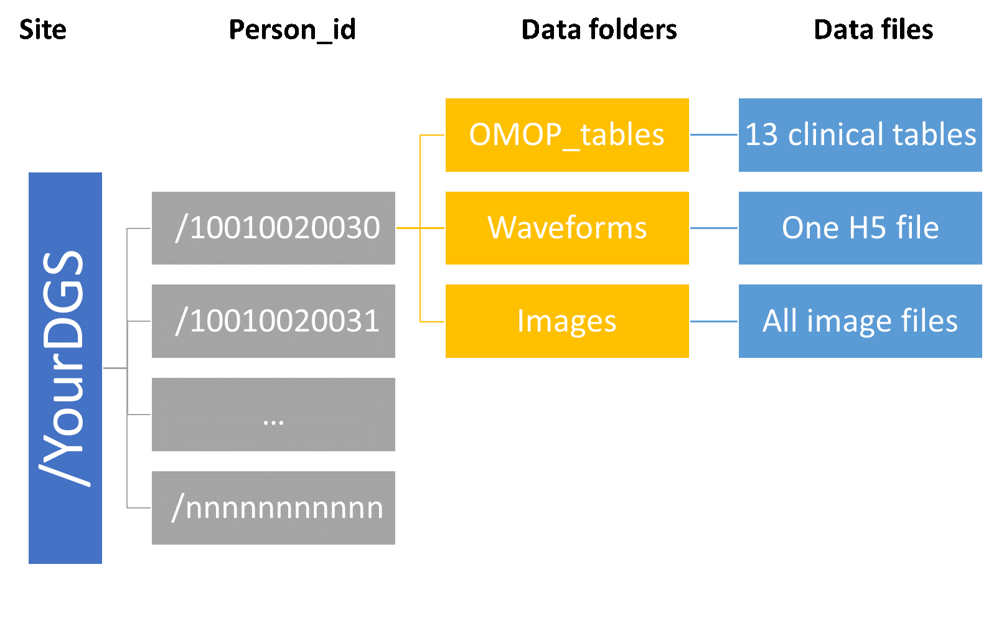

# Upload data to Center Datawareohuse

 [Download Data Uploading SOP doc](https://github.com/chorus-ai/data_acq_SOP/blob/main/sop-website/docs/Data-Uploading/Data%20Upload%20SOP.docx)

## Purpose

The purpose of this Standard Operating Procedure (SOP) is to specify the expected structure of the data to be uploaded to the central CHoRUS cloud environment.

## Upload schedule

Upload of a pilot dataset of a minimum of 25 patients is required from each site July 15, 2023. This specific request is detailed is previous comuunication and also {here}. The first upload of 25% of patients contributed to the CHoRUS dataset is due December 30th, 2023. The second, third and last uploads will be due on September 30th of 2024, 2025, and 2026.

## Rationale

Sites will generate data that will need to merged in such a way that the end-user is agnostic of data provenance. Data merging is facilitated by data generation sites developing a process which results in the production of data files that are compatible in format, uploaded to pre-determined folder architecture. The purpose of this SOP is to describe this folder architecture. CHoRUS does not require that each data generation site creates and populates a folder architecture that emulates the central architecture, although doing so may facilitate the debugging of applications dedicated to central uploading of data.

## The centralized cloud environment

This virtual linux server environment is hosted in an Azure platform. Connection parameters and authentication procedures are described here. The folder structure is setup such that each data generation site (DGS) can access their home folder (e.g. /CHoRUSDataRepository/yourDGS).

## Target folder structure

Each DGS will be required to deposit data and metadata files in a dedicated centralized staging environment. This staging environment is a virtual linux server with read/write access for each DGS to their own home folders. The root folder should also contain an updated ReadMe file describing the contain to be found under each data folder and a running history of uploads. We have not planned to provide a template for the ReadMe file, but may do so as needed. Please refer to Figure 1 which depicts the folder structure to upload to.

## Update mechanism

It is expected that updates will be limited to the inclusion of new patient_id folders, as well as completion of data files in existing folders as these become more complete or updated following mandatory quality checks. For example, image files become available. These updates can be asynchronous with the expected yearly major uploads, but the ReadMe file must accurately reflect the content of the data folders (/EHR, /Waveforms and /Images)

## Expectations as to file content

### The EHR folder

This folder should include structured and unstructured 14 OMOP clinical data files as found here (https://ohdsi.github.io/CommonDataModel/cdm54.html#Clinical_Data_Tables). We are not requiring actual notes to be included in the "note_text" field of the NOTE table, but since working with the NOTE_NLP table would greatly benefit from access to foreign keys only present in the NOTE table. Thus the note table should at least contain core identifiers (note_id), descriptors (note_type_concept_id and note_class_concept_id) as well as there foreign keys to PERSON, VISIT_OCURRENCE, VISIT_DETAILS. Each of these table will be in the form of comma delimited files with header rows, with only the records pertaining to the person_id of interest. It will be a centralized responsibility to collate all patients from all sites into a queryable environment.

### The Waveforms folder

According to usage described in the DA SOPs {links}, Waveform data refers to all data acquired from bedside monitors and devices, including alarms, numerics data obtain at regular of irregular intervals, and high-frequency (>1 Hz) waveform data such as digitized EKG tracings.

This folder will include a single h5 file collating all waveform data, inclusive of its metadata, following the CCDEF hdf5 format described in the SOP {link}.

### The Images folder
